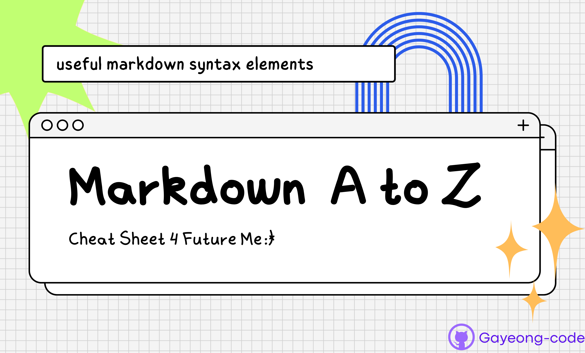

<!-- Headings -->
# Heading 1
## Heading 2
### Heading 3
#### Heading 4
##### Heading 5
###### Heading 6

<!-- Plain text -->
Paragraph 

<!-- line : triple underscore-->
---

<!-- Text Attributes -->

This is the **bold** text.
This is *italic* text. (two spaces end of the line creates new line)  
Let's do ~~strikethrough!~~

<!-- Quote -->
>"The secret of getting ahead is getting started."- *MARK TWAIN*

<!-- Bullet List -->
Fruits: 
* 🍎
* 🍍
* 🍌

Vegetables:
- 🥕
- 🥬
- 🍅

<!-- Numbered List -->
Fruit and Vegetables:
1. 🍎
2. 🍍
3. 🍌
4. 🥕
5. 🥬
6. 🍅


<!-- Task list -->
Shopping List
- [x] egg   
- [ ] 
- [ ]
- [ ]

<!-- Link -->

Click [here](www.google.com)!

<!-- Image -->
image format:
""


Arrange the size of the img with **html**  


<!-- Table -->
Using '|' 
content arrangement ':'
|Header|Description|
|:--:|:--:|
|cell1|cell2|
|cell3|cell4|
|cell5|cell6|

<!-- Code -->
To print message in the console, use `console.log('hello world')` in javascript.
```js
console.log('hello world')
```
```py
print('hello world')
```

